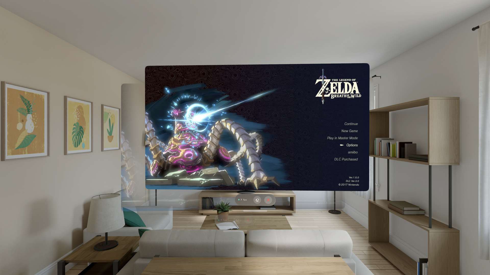

# Kagami

Your Nintendo Switch's screen, on your Apple Vision Pro.



## What it is

Kagami is a native visionOS app that connects directly to a Switch running
Atmosphère with [SysDVR](https://github.com/exelix11/SysDVR) installed, over your
local network — no capture card, no Mac or PC in the middle, no cost.

SysDVR's TCP Bridge mode streams the console's own H.264 video and PCM audio.
Kagami speaks that protocol itself: it decodes the video with VideoToolbox (the
same hardware decoder the OS uses everywhere else) and renders it as a floating
window in space.

The one thing it does beyond mirroring the screen: the space around the picture
picks up the average colour of whatever is on it, like bias lighting behind a
TV. A cave level dims the room; a snow field brightens it.

## Requirements

On the Switch:

1. [Atmosphère](https://github.com/Atmosphere-NX/Atmosphere), with
   [SysDVR](https://github.com/exelix11/SysDVR) installed as a sysmodule.
2. SysDVR set to **TCP Bridge** mode, then reboot the console. Simple network
   mode uses RTSP and is a different protocol.
3. Both devices on the same network — wired beats Wi-Fi for this.

On the headset: visionOS 26 or later.

## Building

```bash
xcodegen generate
open Kagami.xcodeproj
```

Build and run the `Kagami` scheme on your Vision Pro or the visionOS simulator.
The Run action uses Release optimization so the parser and decoder are not
benchmarked in an unoptimized debug build.

## How it works

- `Sources/Protocol/` — the SysDVR wire format: handshake, packet framing, and the
  Annex-B ↔ length-prefixed repacking VideoToolbox needs. Transcribed from the
  reference client, not guessed.
- `Sources/Media/` — H.264 decode (VideoToolbox) and PCM playback (AVAudioEngine).
- `Sources/UI/` — the interface: the connect screen, the floating screen, and the
  ambient light.
- `Tools/fake-console.py` — a stand-in SysDVR server for testing without a Switch
  powered on. It speaks the exact same handshake and packet framing, so if Kagami
  shows a picture from it, the protocol and decode path are proven end to end.

## Testing without a console

```bash
python3 Tools/fake-console.py
```

This serves a real H.264 test pattern on ports 9911/9922, exactly as SysDVR would.
Point Kagami at `127.0.0.1` (the visionOS Simulator shares the Mac's network stack)
to see it decode and render.

## Latency and connection recovery

Video stays in YUV from VideoToolbox to `AVSampleBufferDisplayLayer`, with immediate
presentation. The receive queue holds at most three compressed packets; the decoded
queue retains only the newest frame. A compressed sequence gap waits for an IDR to
avoid broken reference pictures. Sustained excess delay triggers a fresh connection.
Audio queues at most three normal 1024-frame payloads (about 64 ms), flushing older
sound after bursts. Ambient color sampling runs independently of the UI actor.

TCP connection/handshake attempts have a six-second deadline. Transient failures
retry automatically, audio can reconnect independently, and disconnect cancels
pending socket reads. HOME can legitimately stop capture without closing TCP.
Session generations prevent old callbacks from changing a new connection.

The FPS readout uses the video renderer's total frame count minus dropped frames,
sampled over the actual elapsed interval. It does not count incoming packets or
clamp the result to 30. SysDVR itself caps capture at 720p30; source, Wi-Fi and headset
display performance still need real-device measurement. One-way timestamps measure
additional delay, not absolute controller-to-photon latency.

Run the core regression tests on macOS 15.4+ without a simulator:

```bash
swift test -c release -j 2 -Xswiftc -no-whole-module-optimization
```

The explicit optimization flag works around a Swift 6.3 whole-module test compilation
error. Tests exercise stalled handshakes, cancellation, malformed headers, bounded
bursts, timestamp units, keyframe recovery and a ten-second 720p30 decode run.
The generated fixture is an FFmpeg `testsrc2` keyframe; it contains no game footage.
These core tests do not measure headset display FPS or validate the immersive view.

For a short device diagnostic run, launch with `-streamDiagnostics YES` to print
renderer FPS, submitted frames and displayed frames once per second. This is off
by default.
